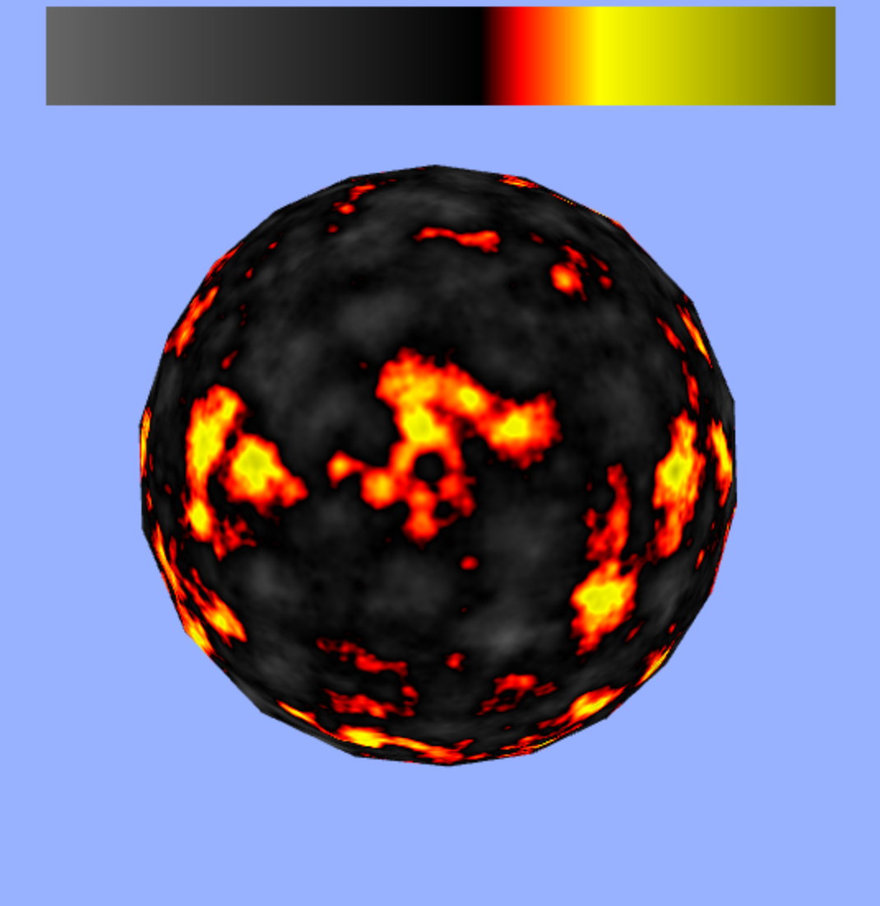
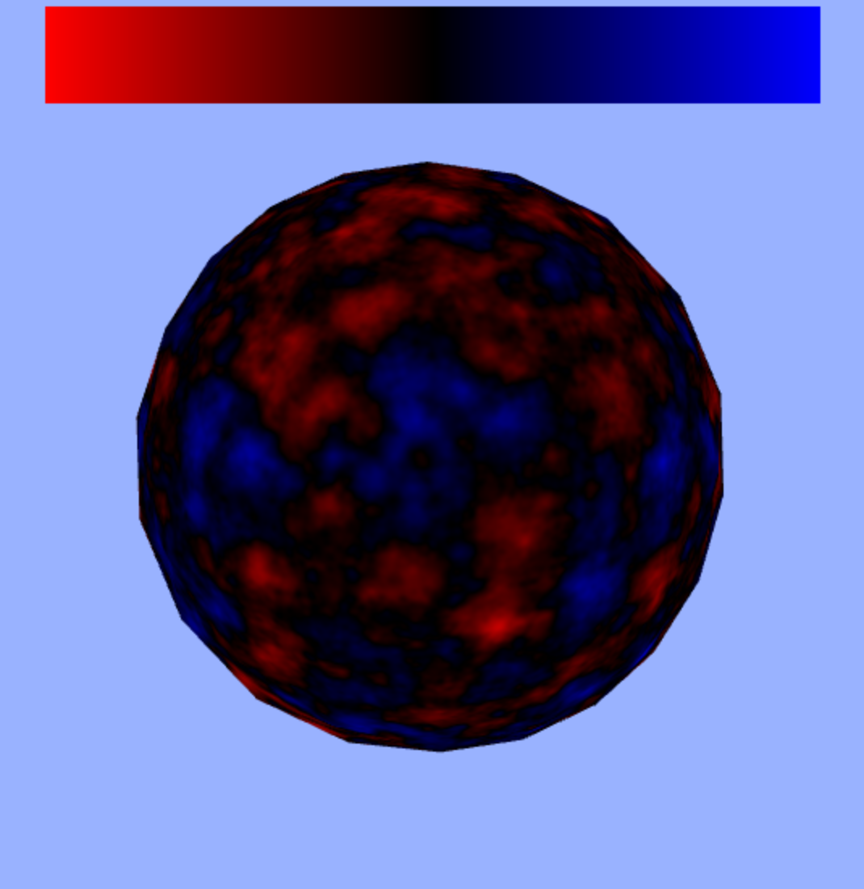

# glsl-gradient-palette

[](https://www.npmjs.com/package/glsl-gradient-palette)

This module can be used to create gradient color palettes. These can be used to colorize noise functions and procedurally
generate textures in shaders. Below is an example of such a procedural texture.



More examples can be found in the provided [demo](http://erkaman.github.io/glsl-gradient-palette/)

## Usage

To create a gradient palette, you basically give the API a sequential list of colors. The API will then create a
palette, by linearly interpolating between these colors. It is very easy to create a palette:

```javascript
    var simple =  [
        [0.0, [1.0,0.0,0.0]],
        [0.5, [0.0,0.0,0.0]],
        [1.0, [0.0,0.0,1.0]],
    ];

    simplePaletteTexture = createGradientPalette(gl,simple);
```

above, we create a palette where we first interpolate from red to black, and then from black to red. To be more specific,
From `0.0` to `0.5` we interpolate between the RGB colors `[1.0,0.0,0.0]` and `[0.0,0.0,0.0]`, and from
`0.5` to `1.0` we interpolate from  `[0.0,0.0,0.0]` to `[0.0,0.0,1.0]`. The palette we just have created will
look like this:



in the upper parts of the image, we can see the palette, and below, we see what happens if we use the palette to
colorize a noise function.

It is easy to use the created palette in a shader. `createGradientPalette` will return the created palette as a
texture(as a `gl-texture2d`), and this texture can be sent to a shader by doing

```javascript
   sphereShader.uniforms.uPalette = simplePaletteTexture.bind()
```

now we can use it to colorize a noise function by sampling from it, based on the noise value:

```glsl
   float t = noise(vPosition);
   vec3 tex =   texture2D(uPalette, vec2(t, 0.0) ).xyz;
```

and that results in the textured sphere seen above.

By specifying more colors, we can create more advanced textures. For instance, the palette

```javascript

    var fireball =  [
        [0.0, [0.4,0.4,0.4]],
        [0.55, [0.0,0.0,0.0]],
        [0.60, [1.0,0.0, 0.0]],
        [0.70, [1.0,1.0, 0.0]],
        [1.0, [0.4,0.4, 0.0]]
    ];
```

results in


## API

### `function createGradientPalette(gl, gradientList[, opts])`

Creates a gradient palette, and returns the created palette stored as a `gl-texture2d`, with a default size of
`1024x1`.

* `gl` your WebGL context.
* `gradientList` the list of colors to use when creating the palette. See the previous section for more details.
* `opts` optional arguments objects. Can currently only contain the property `opts.size`, which specifies the width
of the created palette texture. Defaults to `1024`.

### `paletteDrawer = new PaletteDrawer(gl, position, size)`

Creates a palette drawer, that can be used for drawing a palette texture on the screen. Useful for visualising a palette.

* `gl` your WebGL context.
* `position` the pixel position where your palette drawer will be drawn. Stored as an array `[x,y]`.
* `size` the pixel size of your palette drawer. Stored as an array`[x_size,y_size]`.


### `paletteDrawer.draw(paletteTexture, canvasWidth, canvasHeight)`

Draws a palette texture as a simple quad.

* `paletteTexture` the palette texture to draw.
* `canvasWidth` the width of the canvas.
* `canvasHeight` the height of the canvas.
